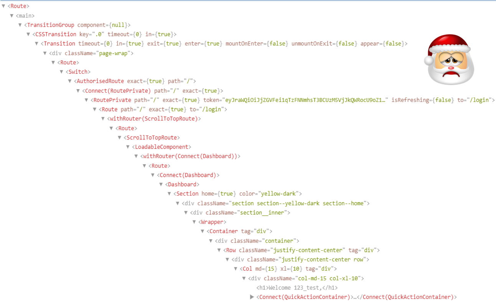

import './script.js'
import {Appear} from 'mdx-deck'
import {
  ToggleButton, 
  MultiToggleButtons, 
  BackgroundTimer, 
  BackgroundTimerOptimization,
  CustomHookBackgroundTimer
} from './components'

import "babel-polyfill";

export {default as theme} from './theme'


## Introduction to React Hooks API


---

## What is Hooks ?

<div style={{fontSize: 40, textAlign: 'left'}}>
  <ul>
    <Appear>
      <li className="list-margins">New React built-in functions in version 16.8+</li>
      <li className="list-margins">Functions which "hook into" React state and lifecycle features</li>
      <li className="list-margins">Not work inside class component</li>
    </Appear>
  </ul>
</div>

---

## Motivation

<div style={{fontSize: 40, textAlign: 'left'}}>
  <ul>
    <Appear>
      <li className="list-margins">Avoid HOC wrapper hell</li>
    </Appear>
  </ul>
</div>

---

### HOC wrapper hell



---

## Motivation

<div style={{fontSize: 40, textAlign: 'left'}}>
  <ul>
      <li className="list-margins">Avoid HOC wrapper hell</li>
    <Appear>
      <li className="list-margins">Split and reuse component stateful logic</li>
    </Appear>
  </ul>
</div>

---

### Class component with life cycle methods

```jsx
class Example extends React.Component {
  constructor(props) {
    ... state
  }

  componentDidMount() {
    ... after initial render
  }

  componentDidUpdate() {
    ... after every update
  }

  componentWillUnmount() {
    ... before component unmounts
  }

  render() {
    ... jsx
  }
}
```

---

## Motivation

<div style={{fontSize: 40, textAlign: 'left'}}>
  <ul>
      <li className="list-margins">Avoid HOC wrapper hell</li>
      <li className="list-margins">Split and reuse component stateful logic</li>
    <Appear>
      <li className="list-margins">Overall: reduce complexity and simplify development</li>
    </Appear>
  </ul>
</div>

---

### How to change state with Hooks ? 

<ToggleButton />

```jsx
import React, {useState} from 'react';

function Toggle() {
  const [toggle, setToggle] = useState(false);

  return (
    <>
      <button className="btn-blue" onClick={() => setToggle(!toggle)}>Toggle</button>
      {toggle && <h3>This is the content</h3>}
    </>
  );
}
```


---

### Handle multiple states

<MultiToggleButtons />

```jsx
function MultiToggleButtons() {
  const [toggleL, setToggleL] = useState(false);
  const [toggleR, setToggleR] = useState(false);

  return (
    <>
      <button className="btn-blue" onClick={() => setToggleL(!toggleL)}>Toggle Left</button>
      <button className="btn-green" onClick={() => setToggleR(!toggleR)}>Toggle Right</button>

      {toggleL && <h3>Left toggle content</h3>}
      {toggleR && <h3>Right toggle content</h3>}
    </>
  );
}
```


---

### Life cycle methods with Hooks ?

- ComponentDidMount()
- ComponentDidUpdate() 
- ComponentWillUnmount()
<br/>
- You can use useEffect Hook to simulate this functionality

---

### Stateful component life cycle


---

### useEffect Hook unify life cycle methods 

```jsx

import React, { useEffect } from "react";

function Component() {

  useEffect(() => {

    // manages the same thing as:

    // componentDidMount()
    // componentDidUpdate()
    // componentWillUnmount()

  })

  return (
    ... jsx
  )

}

```

---

### Example of useEffect Hook

<BackgroundTimer />

```jsx
import React, { useState, useEffect } from "react";

function BackgroundTimer() {
  const [toggleL, setToggleL] = useState(false);
  const [toggleR, setToggleR] = useState(false);

  useEffect(() => {
    setTimeout(() => {
      const colorful = document.querySelectorAll(".colorful")[0];
      colorful.style.background = getRandomColor();
    }, 1000);
  });

  return (
    <>
      <button className="btn-blue" onClick={() => setToggleL(!toggleL)}>Toggle Left</button>
      <button className="btn-green" onClick={() => setToggleR(!toggleR)}>Toggle Right</button>
      <div className="colorful" />
    </>
  );
}
```

---

### useEffect Hook optimization

<BackgroundTimerOptimization />

```jsx
function BackgroundTimerOptimization() {
  const [toggleL, setToggleL] = useState(false);
  const [toggleR, setToggleR] = useState(false);

  useEffect(() => {
    setTimeout(() => {
      const colorful = document.querySelectorAll(".colorful")[0];
      colorful.style.background = getRandomColor();
    }, 1000);
  }, [toggleL]);

  ...
}
```

---

### Cleanup with useEffect 

```jsx
function BackgroundTimerOptimization() {
  const [toggleL, setToggleL] = useState(false);
  const [toggleR, setToggleR] = useState(false);

  useEffect(() => {
    const timer = setTimeout(() => {
      const colorful = document.querySelectorAll(".colorful")[0];
      colorful.style.background = getRandomColor();
    }, 1000);

    return () => clearTimeout(timer)

  }, [toggleL]);

  ...
}
```

---

### Custom Hook: way to reuse stateful logic 

  ```jsx
  import { useEffect } from "react";
  import { getRandomColor } from "./helpers";

  export function useBackgroundTimer(toggleState) {
    useEffect(() => {
      const timer = setTimeout(() => {
        const colorful = document.querySelectorAll(".colorful")[0];
        colorful.style.background = getRandomColor();
      }, 1000);

      return () => clearTimeout(timer);

    }, [toggleState]);
  }
  ```

---

### Use custom Hook in component

<CustomHookBackgroundTimer />

```jsx
import { useBackgroundTimer } from "./useBackgroundTimer";

function CustomHookBackgroundTimer() {
  const [toggleL, setToggleL] = useState(false);
  const [toggleR, setToggleR] = useState(false);

  useBackgroundTimer(toggleL);

  return (
    <>
      <button className="btn-blue" onClick={() => setToggleL(!toggleL)}>Toggle Left</button>
      <button className="btn-green" onClick={() => setToggleR(!toggleR)}>Toggle Right</button>
      <div className="colorful" />
    </>
  );
}
```

---

## Questions ?
